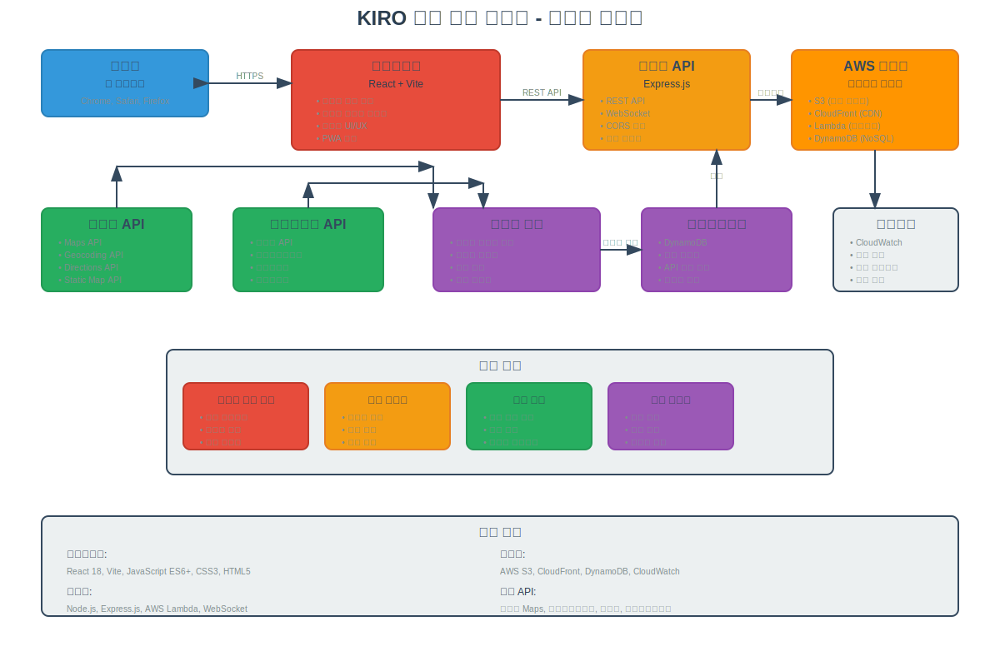

# Kiro와 함께하는 국가위기 및 사회현안 해결 - 침수 정보 표시 앱

실시간 홍수 정보를 제공하는 웹 애플리케이션입니다.

## 🏗️ 시스템 구성도

### 전체 시스템 아키텍처


### AWS 클라우드 아키텍처
📋 **[AWS 아키텍처 상세 보기](docs/AWS_ARCHITECTURE.md)**

```
사용자 → CloudFront → S3 (정적 웹사이트)
       ↓
    API Gateway → Lambda → DynamoDB
       ↓
    외부 API (네이버, 공공데이터, 기상청)
```

## 🚀 주요 기능

- 실시간 홍수 데이터 조회
- 네이버 지도 기반 시각화
- 위치 기반 홍수 정보 제공
- 안전 경로 안내
- 다중 API 소스 통합

## 📋 사전 요구사항

- Node.js 16.x 이상
- npm 또는 yarn
- AWS 계정 (배포 시)
- 네이버 개발자 계정 (지도 API 사용)

## 🔧 환경 설정

### 1. 환경 변수 설정

프로젝트 루트의 `frontend` 폴더에서 환경 변수를 설정하세요:

```bash
cd frontend
cp .env.example .env.local
```

`.env.local` 파일을 편집하여 실제 값으로 변경하세요:

```env
# 네이버 지도 API 클라이언트 ID
# https://developers.naver.com/에서 발급받으세요
VITE_NAVER_MAP_CLIENT_ID=YOUR_NAVER_MAP_CLIENT_ID_HERE

# 백엔드 API URL
VITE_API_BASE_URL=http://localhost:3000

# 개발 환경 설정
VITE_NODE_ENV=development
```

### 2. 네이버 지도 API 키 발급

1. [네이버 개발자 센터](https://developers.naver.com/)에 접속
2. 애플리케이션 등록
3. Maps API 서비스 추가
4. 클라이언트 ID 복사하여 환경 변수에 설정

### 3. AWS 설정 (배포 시)

AWS CLI를 설치하고 자격 증명을 설정하세요:

```bash
aws configure
```

다음 정보를 입력하세요:
- AWS Access Key ID: `YOUR_AWS_ACCESS_KEY_ID`
- AWS Secret Access Key: `YOUR_AWS_SECRET_ACCESS_KEY`
- Default region name: `YOUR_AWS_REGION`
- Default output format: `json`

## 🏃‍♂️ 실행 방법

### 개발 환경

1. 의존성 설치:
```bash
npm install
cd frontend && npm install
```

2. 백엔드 서버 실행:
```bash
npm start
```

3. 프론트엔드 개발 서버 실행:
```bash
cd frontend
npm run dev
```

4. 브라우저에서 `http://localhost:5173` 접속

### 프로덕션 빌드

```bash
cd frontend
npm run build
```

## 🏗️ 배포

### AWS S3 + CloudFront 배포

1. 인프라 배포:
```bash
# S3 버킷 생성
aws cloudformation deploy \
  --template-file infrastructure/s3-bucket.yml \
  --stack-name flood-info-s3 \
  --parameter-overrides Stage=prod

# DynamoDB 테이블 생성
aws cloudformation deploy \
  --template-file infrastructure/dynamodb-table.yml \
  --stack-name flood-info-db \
  --parameter-overrides Stage=prod
```

2. 프론트엔드 배포:
```bash
cd frontend
npm run build
aws s3 sync dist/ s3://YOUR_BUCKET_NAME --delete
```

## 📁 프로젝트 구조

```
Kiro와 함께하는 국가위기 및 사회현안 해결/
├── frontend/                 # React 프론트엔드
│   ├── src/
│   │   ├── services/        # API 서비스
│   │   ├── utils/           # 유틸리티 함수
│   │   └── ...
│   ├── .env.example         # 환경 변수 예제
│   └── package.json
├── infrastructure/          # AWS 인프라 템플릿
│   ├── s3-bucket.yml       # S3 버킷 설정
│   └── dynamodb-table.yml  # DynamoDB 테이블 설정
├── lambda-functions/        # AWS Lambda 함수
├── docs/                   # API 문서
├── server.js               # Express 백엔드 서버
└── package.json
```

## 🔐 보안 주의사항

- `.env.local` 파일은 절대 Git에 커밋하지 마세요
- API 키와 시크릿은 환경 변수로 관리하세요
- AWS 자격 증명은 안전하게 보관하세요
- 프로덕션 환경에서는 HTTPS를 사용하세요

## 🤝 기여하기

1. 이 저장소를 포크하세요
2. 기능 브랜치를 생성하세요 (`git checkout -b feature/AmazingFeature`)
3. 변경사항을 커밋하세요 (`git commit -m 'Add some AmazingFeature'`)
4. 브랜치에 푸시하세요 (`git push origin feature/AmazingFeature`)
5. Pull Request를 생성하세요

## 📄 라이선스

이 프로젝트는 MIT 라이선스 하에 배포됩니다.

[](https://opensource.org/licenses/MIT)

```
MIT License - 자유롭게 사용, 수정, 배포 가능
- ✅ 상업적 사용 허용
- ✅ 수정 허용  
- ✅ 배포 허용
- ✅ 개인 사용 허용
- ⚠️ 저작권 표시 필수
```

자세한 내용은 [LICENSE](LICENSE) 파일을 참조하세요.

## 📞 문의

프로젝트에 대한 문의사항이 있으시면 이슈를 생성해 주세요.
